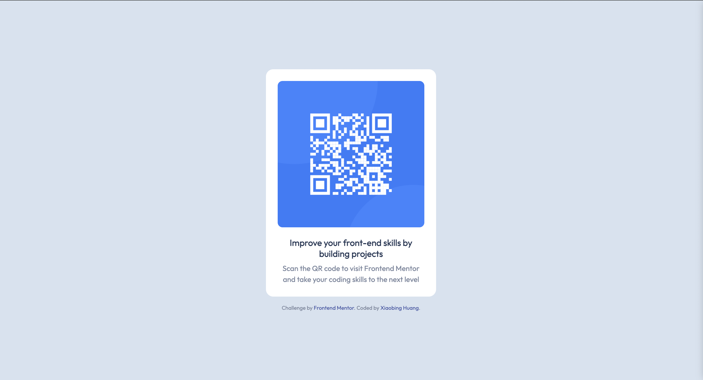

# Frontend Mentor - QR code component solution

This is a solution to the [QR code component challenge on Frontend Mentor](https://www.frontendmentor.io/challenges/qr-code-component-iux_sIO_H). Frontend Mentor challenges help you improve your coding skills by building realistic projects. 

## Table of contents

- [Overview](#overview)
  - [Screenshot](#screenshot)
  - [Links](#links)
- [My process](#my-process)
  - [Built with](#built-with)
  - [What I learned](#what-i-learned)
  - [Continued development](#continued-development)
  - [Useful resources](#useful-resources)
- [Author](#author)
- [Acknowledgments](#acknowledgments)

**Note: Delete this note and update the table of contents based on what sections you keep.**

## Overview
This is a QR Code component challenge from [Frontend Mentor](https://www.frontendmentor.io), designed to improve front-end skills by building real projects.

### Screenshot

### Links
- Solution URL: https://github.com/XiaobingHuang/QR-Code-Component/
- Live Site URL: https://xiaobinghuang.github.io/QR-Code-Component/

### Built with
- Semantic HTML5 markup
- CSS Flexbox
- Responsive Design using `vh` and `rem` units
- [Google Fonts - Outfit](https://fonts.google.com/specimen/Outfit)

### What I learned

This project was a great practice in using CSS Flexbox for layout and ensuring responsive design. I practiced using Flexbox properties like `align-items`, `justify-content`, and `flex-direction` to center elements both vertically and horizontally. Additionally, I used `rem` and `vh` units to maintain responsiveness across devices, enhancing accessibility and scalability.

